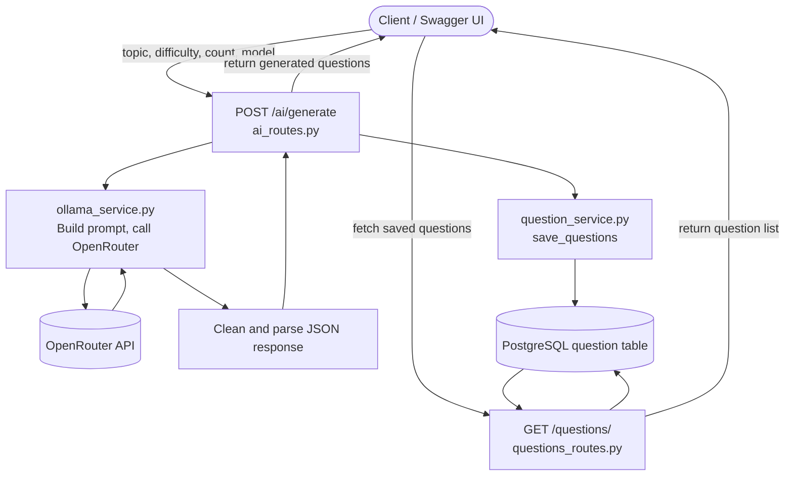

# AI Question Generator API

A FastAPI backend that generates multiple-choice questions on a given topic using an AI model via OpenRouter, and stores them in a PostgreSQL database for retrieval.

## Tech Stack

- **Framework:** FastAPI
- **Database:** PostgreSQL (via SQLAlchemy ORM)
- **AI Provider:** OpenRouter (model selectable per request)
- **Language:** Python 3.12

## Project Structure

```
backend/
├── app/
│   ├── api/
│   │   ├── ai_routes.py          # POST /ai/generate
│   │   └── questions_routes.py   # GET /questions/
│   ├── database/
│   │   ├── db.py                 # SQLAlchemy engine + Base
│   │   └── session.py            # DB session dependency
│   ├── models/
│   │   └── question.py           # Question table schema
│   ├── schemas/
│   │   └── question_schema.py    # Pydantic enums (Topic, Difficulty)
│   └── services/
│       ├── ollama_service.py     # Calls OpenRouter, parses AI response
│       └── question_service.py   # Saves questions to DB
├── main.py                       # App entrypoint
├── requirements.txt
└── .env                          # DATABASE_URL, OPENROUTER_API_KEY (not committed)
```

## Setup & Running Locally

1. **Clone the repo and navigate into backend**

```bash
   git clone <your-repo-url>
   cd backend
```

2. **Create and activate a virtual environment**

```bash
   python -m venv venv
   venv\Scripts\activate      # Windows
   source venv/bin/activate   # macOS/Linux
```

3. **Install dependencies**

```bash
   pip install -r requirements.txt
```

4. **Create a `.env` file** in `backend/` with:

```
   DATABASE_URL=postgresql://<user>:<password>@localhost:5432/<dbname>
   OPENROUTER_API_KEY=<your_openrouter_api_key>
```

5. **Make sure PostgreSQL is running** and the database in `DATABASE_URL` exists. The `question` table is created automatically on startup.

6. **Run the server**

```bash
   uvicorn main:app --reload
```

7. **Open API docs** at `http://127.0.0.1:8000/docs` to test endpoints interactively.

## API Endpoints

| Method | Endpoint | Description |
|--------|----------|-------------|
| POST   | `/ai/generate` | Generate MCQs for a topic and save them |
| GET    | `/questions/` | Retrieve all saved questions |
| GET    | `/questions/{question_id}` | Retrieve a single question by ID |

## Project Flow

1. Client sends a request to `POST /ai/generate` with `topic`, `difficulty`, `count`, and `model`.
2. `ai_routes.py` receives the request and calls `ollama_service.generate_questions()`.
3. `ollama_service.py` builds a prompt and sends it to OpenRouter's chat completion API.
4. The AI's raw response is cleaned (strips markdown fences, extracts JSON array, validates parsing) and converted into a list of question objects.
5. `ai_routes.py` passes the parsed questions to `question_service.save_questions()`.
6. `question_service.py` maps each question into a `Question` ORM model and commits it to PostgreSQL.
7. The generated questions are returned to the client as the API response.
8. Separately, `GET /questions/` can be called at any time to retrieve all saved questions from the database via `questions_routes.py`.

## Flowchart


